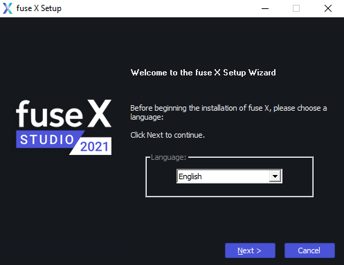
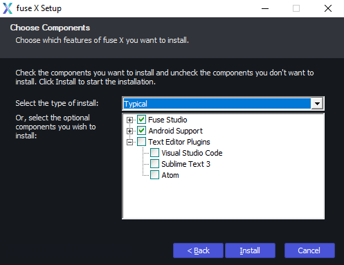
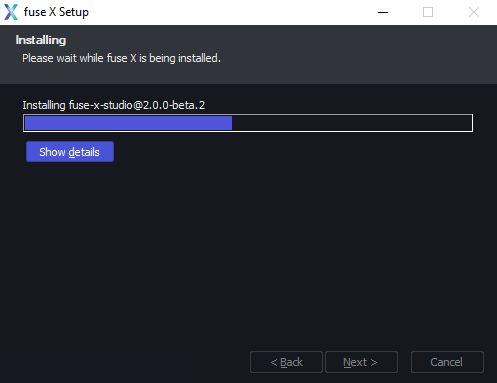

# fuse-setup

> The new Windows installer for Fuse Studio 2.0.

## Introduction

An NSIS installer that uses Node.js and NPM to install its payload(s), and that automatically detects or installs missing dependencies, such as:

* Git for Windows
* Node.js
* VC++ redistributables

The source code is provided as an example for other Node.js-powered apps that may need a GUI-based installer for Windows.

### Related packages

* [fuse-studio](https://github.com/fuse-x/studio)

### Screenshots

## Contributing

Please [report an issue](https://github.com/mortend/nsis-installer/issues) if you encounter a problem, or [open a pull request](https://github.com/mortend/nsis-installer/pulls) if you make a patch.
